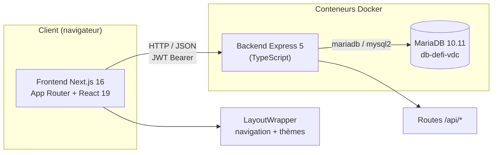
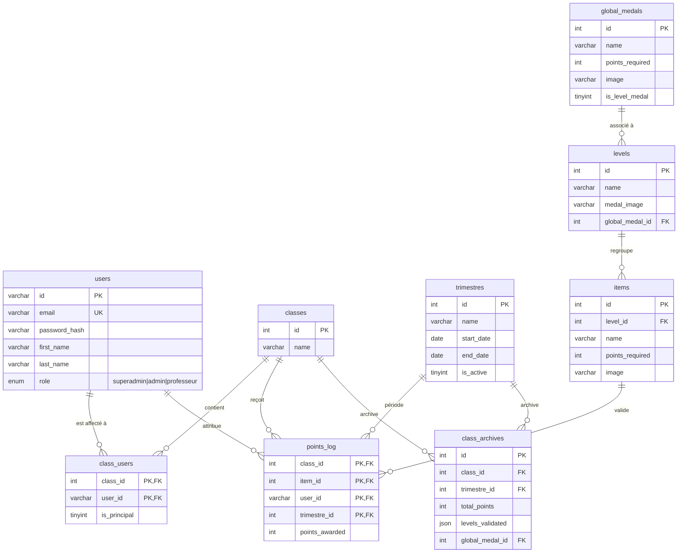
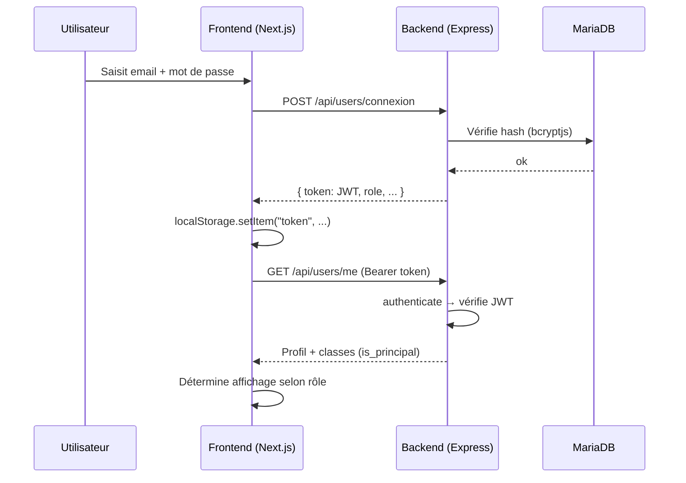
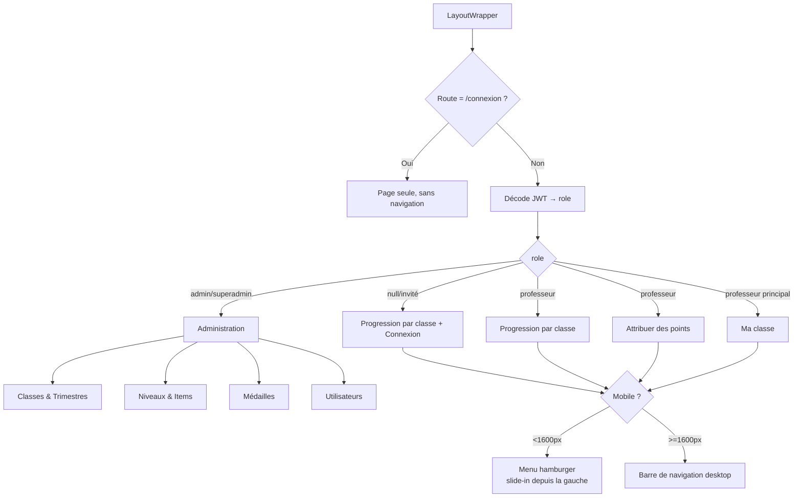
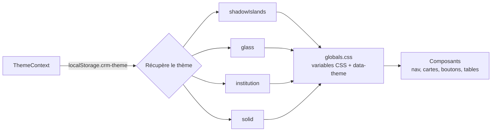
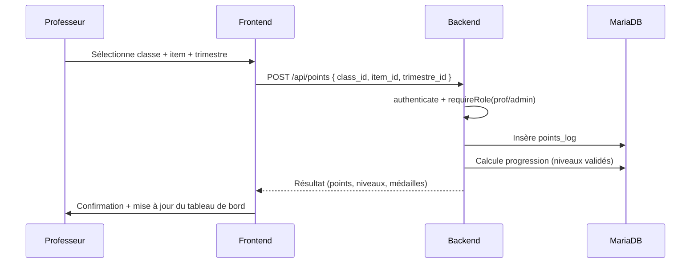

# Documentation technique — DEFI · Vie de classe

Documentation de référence de l'application **DEFI · Vie de classe** pour
l'Ensemble Scolaire Jean XXIII. Elle couvre l'architecture globale, le modèle
de données, l'authentification, la navigation, l'API backend et le système de
thèmes, avec des diagrammes Mermaid pour illustrer les flux.

---

## Sommaire

1. [Architecture globale](#architecture-globale)
2. [Base de données](#base-de-données)
3. [Authentification](#authentification)
4. [Navigation et rôles](#navigation-et-rôles)
5. [API Backend](#api-backend)
6. [Emails (SMTP)](#emails-smtp)
7. [Système de thèmes](#système-de-thèmes)
8. [Attribution de points](#attribution-de-points)

---

## Architecture globale

L'application est composée de trois services conteneurisés avec Docker Compose,
orchestrés par `Makefile`. Le frontend Next.js consomme l'API Express via des
services TypeScript (couche `frontend/app/services/`).

- **Frontend** (`frontend/`) : Next.js 16 (App Router), React 19, Tailwind CSS v4.
  Toutes les pages sont enveloppées par `LayoutWrapper` (navigation, thèmes, toasts).
- **Backend** (`backend/`) : Express 5, exposé sur le port 5000, montée sur `/api/*`.
  Les fichiers statiques uploadés sont servis sur `/uploads`.
- **Base de données** : MariaDB 10.11. Le schéma est initialisé via `init.sql`
  au premier démarrage d'un volume vide.
- **Orchestration** : `docker-compose.yml` (dev) et `docker-compose.prod.yml` (prod),
  pilotées par le `Makefile`.

---

## Base de données

### Modèle relationnel

### Tables et rôles

| Table            | Rôle                                                                                         |
| ---------------- | -------------------------------------------------------------------------------------------- |
| `users`          | Comptes utilisateurs, rôle `ENUM('superadmin','admin','professeur')`                         |
| `classes`        | Classes de l'établissement                                                                   |
| `class_users`    | Affectation professeur → classe, avec flag `is_principal`                                    |
| `trimestres`     | Périodes de jeu avec `is_active` (un seul actif)                                             |
| `levels`         | Niveaux de progression, éventuellement liés à une médaille globale                           |
| `items`          | Actions validables rattachées à un niveau, chacune avec un `points_required`                 |
| `global_medals`  | Médailles globales débloquées par seuil de points (`is_level_medal` pour le mode par niveau) |
| `points_log`     | Journal des points attribués (classe × item × professeur × trimestre)                        |
| `class_archives` | Snapshot des résultats d'une classe par trimestre                                            |

---

## Authentification

Le flux est basé sur un **JWT** stocké côté client (`localStorage['token']`).
Le mittelware `authenticate` décode le token ; `requireRole` restreint ensuite
aux rôles autorisés.

- **Déconnexion** : `localStorage.removeItem("token")` + redirection.
- **Chargement initial** : `LayoutWrapper` parse le JWT (`parseJwt`) → met `role`.
  Pour un `professeur`, il appelle `GET /api/users/me` pour détecter les classes
  où il est professeur principal (`is_principal`).

---

## Navigation et rôles

La navigation est centralisée dans `frontend/app/components/LayoutWrapper.tsx`.
Le composant gère la barre desktop (>1600px), le menu hamburger mobile et le
dropdown Administration.

### Menu hamburger (mobile)

- Visible sous 1600px (breakpoint Tailwind `desktop`, défini dans `globals.css`).
- **Panneau latéral** glissant depuis la gauche (`translate-x`, transition 300 ms
  `ease-out`) sur fond assombri + flou (`backdrop-blur`).
- **Fermeture automatique** :
  - au clic sur un lien (`onNavigate`) ;
  - au changement de route (`useEffect` sur `pathname`) ;
  - au passage au viewport desktop (`matchMedia("(min-width: 1600px)")`) ;
  - au clic sur l'overlay ou sur le bouton de fermeture.

---

## API Backend

Mittelware communs : `authenticate` (JWT) et `requireRole([...])` (contrôle de rôle).

| Méthode  | Route                            | Accès                   | Description                                     |
| -------- | -------------------------------- | ----------------------- | ----------------------------------------------- |
| `POST`   | `/api/users/connexion`           | public                  | Connexion, retourne le JWT                      |
| `GET`    | `/api/users`                     | admin, superadmin       | Liste des utilisateurs                          |
| `GET`    | `/api/users/me`                  | authentifié             | Profil de l'utilisateur connecté                |
| `PUT`    | `/api/users/me`                  | authentifié             | Mise à jour de son propre profil                |
| `POST`   | `/api/users`                     | admin, superadmin       | Crée un utilisateur (+ mot de passe généré)     |
| `PUT`    | `/api/users/:id`                 | admin, superadmin       | Met à jour un utilisateur                       |
| `DELETE` | `/api/users/:id`                 | admin, superadmin       | Supprime un utilisateur                         |
| `GET`    | `/api/classes`                   | public                  | Liste des classes                               |
| `GET`    | `/api/classes/leaderboard`       | public                  | Classement (param `trimestre_id`)               |
| `POST`   | `/api/classes/reset`             | admin, superadmin       | Réinitialise toutes les classes                 |
| `GET`    | `/api/classes/points-by-teacher` | prof, admin, superadmin | Points par professeur et classe                 |
| `GET`    | `/api/classes/:id/teachers`      | public                  | Professeurs d'une classe                        |
| `GET`    | `/api/classes/:id/users`         | admin, superadmin       | Utilisateurs affectés à une classe              |
| `POST`   | `/api/classes/users`             | admin, superadmin       | Affecte un professeur à une classe              |
| `DELETE` | `/api/classes/:id/users/:userId` | admin, superadmin       | Retire un professeur d'une classe               |
| `GET`    | `/api/classes/:id`               | public                  | Détails d'une classe                            |
| `POST`   | `/api/classes`                   | admin, superadmin       | Crée une classe                                 |
| `PUT`    | `/api/classes/:id`               | admin, superadmin       | Modifie une classe                              |
| `DELETE` | `/api/classes/:id`               | admin, superadmin       | Supprime une classe                             |
| `GET`    | `/api/items`                     | public                  | Liste des items                                 |
| `POST`   | `/api/items`                     | admin, superadmin       | Crée un item                                    |
| `PUT`    | `/api/items/:id`                 | admin, superadmin       | Modifie un item                                 |
| `DELETE` | `/api/items/:id`                 | admin, superadmin       | Supprime un item                                |
| `GET`    | `/api/levels`                    | public                  | Liste des niveaux                               |
| `POST`   | `/api/levels`                    | admin, superadmin       | Crée un niveau                                  |
| `PUT`    | `/api/levels/:id`                | admin, superadmin       | Modifie un niveau                               |
| `DELETE` | `/api/levels/:id`                | admin, superadmin       | Supprime un niveau                              |
| `GET`    | `/api/global-medals`             | public                  | Liste des médailles globales                    |
| `POST`   | `/api/global-medals`             | admin, superadmin       | Crée une médaille                               |
| `PUT`    | `/api/global-medals/:id`         | admin, superadmin       | Modifie une médaille                            |
| `DELETE` | `/api/global-medals/:id`         | admin, superadmin       | Supprime une médaille                           |
| `POST`   | `/api/points`                    | prof, admin, superadmin | Attribue un point à une classe                  |
| `GET`    | `/api/points/mine`               | authentifié             | Points attribués par l'utilisateur              |
| `GET`    | `/api/points/progress/:classId`  | public                  | Progression d'une classe (param `trimestre_id`) |
| `GET`    | `/api/trimestres`                | public                  | Liste des trimestres                            |
| `POST`   | `/api/trimestres`                | admin, superadmin       | Crée un trimestre                               |
| `PUT`    | `/api/trimestres/:id`            | admin, superadmin       | Modifie un trimestre                            |
| `DELETE` | `/api/trimestres/:id`            | admin, superadmin       | Supprime un trimestre                           |
| `POST`   | `/api/trimestres/:id/archive`    | admin, superadmin       | Archive un trimestre                            |

Les images uploadées sont servies statiquement via `/uploads`.

---

## Emails (SMTP)

Les emails d'application sont envoyés avec `nodemailer` depuis
`backend/config/mail.ts`. Le template reprend la charte du **thème
`institution`** (style Ensemble Scolaire Jean 23) : fond bleu nuit `#0f172a`,
carte slate `#1e293b`, bandeau supérieur orange `#e84e1b`, texte clair
`#cbd5e1`, lien orange `#fb923c`, et **signature en pied de page**
(`` attaché en ligne depuis `backend/public/signature.png`).

### Configuration

Variables d'environnement définies dans `.env` (racine) et transmises au
container backend via `docker-compose.yml` (dev) et `docker-compose.prod.yml` :

| Variable     | Rôle                                          |
| ------------ | --------------------------------------------- |
| `SMTP_HOST`  | Serveur SMTP (ex. `smtp.hostinger.com`)       |
| `SMTP_PORT`  | Port (465 = SSL, sinon 587 par défaut)        |
| `SMTP_USER`  | Compte émetteur                                |
| `SMTP_PASS`  | Mot de passe du compte émetteur                |
| `SMTP_FROM`  | Adresse d'expédition (sinon `SMTP_USER`)      |
| `FRONTEND_URL` | Lien affiché dans le corps du mail          |

- En **production**, `FRONTEND_URL` doit pointer vers l'URL publique du
  frontend (le fallback dev `http://localhost:3000` ne doit pas y être utilisé).
- Après modification de `.env`, recréer le container : `make dev-up`.

### Fonctions

- `sendMail(to, subject, text, htmlContent?)` : envoi générique stylisé
  (titre = `subject`, corps = `htmlContent` ou `text`, signature en bas).
- `sendWelcomeEmail(to, password, user?)` : email de création de compte
  (lien `FRONTEND_URL`, identifiants, mot de passe temporaire).

### Comportements notables

- **SMTP non configuré** : l'envoi est journalisé en console (`[MAIL] SMTP non
  configuré …`) sans bloquer le flux de développement.
- **Échec d'envoi** : lors de la création d'un utilisateur (`POST /api/users`),
  l'envoi du mot de passe est isolé dans un `try/catch` dédié
  (`createUser` dans `backend/services/userService.ts`). Un échec n'empêche
  pas la création du compte et ne remonte pas une fausse erreur base de données.

---

## Système de thèmes

Quatre thèmes sont définis dans `frontend/app/contexts/ThemeContext.tsx` et
appliqués via des variables CSS (`globals.css`). Le choix est persisté dans
`localStorage['crm-theme']` et appliqué via l'attribut `data-theme` sur
`<html>`.

| Thème                  | Style                                              |
| ---------------------- | -------------------------------------------------- |
| `shadowIslands`        | Verre sombre, arrondi généreux, accent orange      |
| `glass`                | Verre translucide, accent cyan                     |
| `institution` (défaut) | Palette bleu nuit institutionnelle, arrondi modéré |
| `solid`                | Solide, angles droits, sans flou                   |

Chaque thème expose un objet `t` (wrapper, header, main, card, tableHeader,
tableRow, input, btnPrimary, btnGhost, textMuted, title, activeNav, navHover)
consommé par les composants via le hook `useTheme()`.

---

## Attribution de points

Flux métier principal déclenchant la progression des classes.

- La progression d'une classe repose sur la validation d'items
  (`points_required`) rattachés aux niveaux.
- Les **médailles globales** se débloquent soit par un seuil de points
  (`points_required`), soit, si `is_level_medal = 1`, par la validation d'un niveau.
- À la clôture d'un trimestre, `POST /api/trimestres/:id/archive` fige les
  résultats dans `class_archives`.
